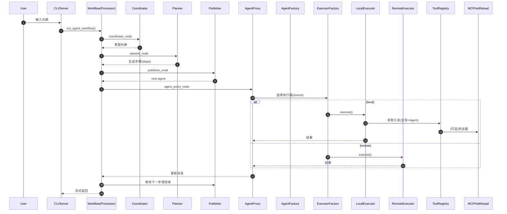
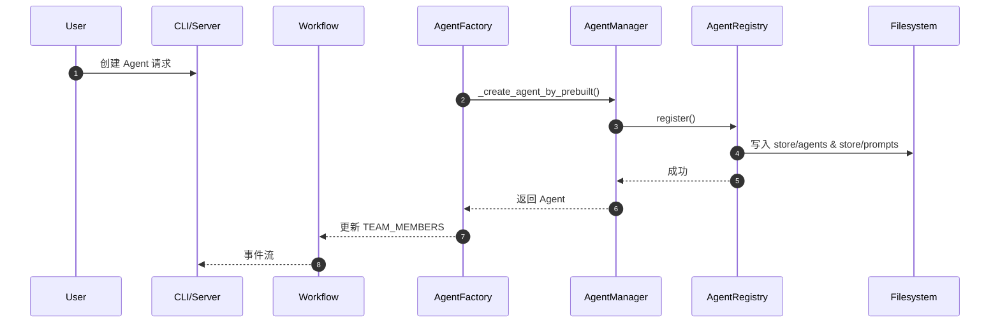

# 项目架构（SuperAgent）

本文档按“角色/职责链路”的方式说明系统结构，每一层都以“核心模块 → 责任 → 关键文件”呈现，便于理解多智能体协作与工具调用的整体路径。

## 0. 总体链路（从请求到响应）

```text
用户请求
  -> 入口层（CLI/Server）
  -> 工作流编排层（Coordinator/Planner/Publisher/AgentProxy）
  -> 执行层（Local/Remote）
  -> 工具管理层（ToolRegistry/MCP）
  -> 结果回传
```

---

## 1. 入口层（CLI / Server）

**角色/职责链路**
- `CLI`：接收命令、构建请求、展示流式结果
  文件：`cli.py`
- `Server`：API 入口、封装工作流调用、Agent/Tool 管理接口
  文件：`src/service/server.py`

---

## 2. 工作流编排层（多智能体协作链路）

**角色/职责链路**
1. `Coordinator`
- 责任：理解用户意图，决定是否进入规划
- 文件：`src/workflow/coor_task.py` → `coordinator_node`

2. `Planner`
- 责任：生成多智能体协作计划（steps）
- 文件：`src/workflow/coor_task.py` → `planner_node`

3. `Publisher / Router`
- 责任：根据计划选择下一位执行的 Agent
- 文件：`src/workflow/coor_task.py` → `publisher_node`

4. `Agent Proxy`
- 责任：调用目标 Agent（本地或远程），收集结果
- 文件：`src/workflow/coor_task.py` → `agent_proxy_node`

5. `Agent Factory`（可选）
- 责任：根据需求动态创建新 Agent

6. `Workflow Graph`（流程骨架）
- 责任：串联节点、驱动执行顺序
- 文件：`src/workflow/graph.py`

7. `Workflow Cache`（状态/记忆）
- 责任：保存步骤、状态、历史
- 文件：`src/workflow/cache.py`

---

## 3. Agent 管理层

**角色/职责链路**
- `AgentRegistry`：Agent CRUD + 持久化
  文件：`src/manager/registry/agent_registry.py`
- `AgentManager`：懒初始化 + 缓存 + Registry 集成
  文件：`src/manager/agents.py`
- `AgentModel`：Agent 数据结构与字段校验（source/endpoint/mcp_config）
  文件：`src/interface/agent.py`

---

## 4. 执行层

**角色/职责链路**
- `ExecutorFactory`：根据 `source` 选择本地或远程执行器
  文件：`src/manager/executor/factory.py`
- `LocalExecutor`：本地 LLM + 工具绑定
  文件：`src/manager/executor/local.py`
- `RemoteExecutor`：HTTP 调用远程 Agent
  文件：`src/manager/executor/remote.py`

---

## 5. 工具管理层

**角色/职责链路**
- `ToolRegistry`：统一工具注册中心（全局 + Agent 专属）
  文件：`src/manager/registry/tool_registry.py`
- `ToolLoader`：内置工具 + MCP 工具加载（缓存/超时/连接池）
  文件：`src/manager/registry/tool_loader.py`
- `MCPHotReload`：热加载（快照/回滚/变更检测）
  文件：`src/manager/hot_reload/mcp_reload.py`
- `MCPConfig`：MCP 配置解析与单例管理
  文件：`src/manager/mcp.py`
- `ToolIdentifier`：工具唯一标识（scope/server/name）
  文件：`src/manager/registry/tool_identifier.py`

---

## 6. 文件系统存储

**角色/职责链路**
- `Agent 定义`：`store/agents/*.json`
- `Prompt 模板`：`store/prompts/*.md`
- `Workflow 状态`：`store/workflows/*.json`
- `Tool 定义`：`store/tools/`

---

## 7. 协作流程图（多智能体执行）



---

## 8. 调用时序图（Agent 创建流程）



---

## 9. 扩展点

- 新增内置工具：`src/tools/*.py` + `ToolLoader`
- 新增 MCP 工具：更新 `config/mcp.json`，使用热加载
- 新增 Agent 类型：扩展 `Agent` 模型或添加新执行器
- 新增流程节点：扩展 `coor_task.py` 或 `graph.py`

---

本文档按“角色/职责链路”方式整理，便于定位模块责任与数据流路径。
